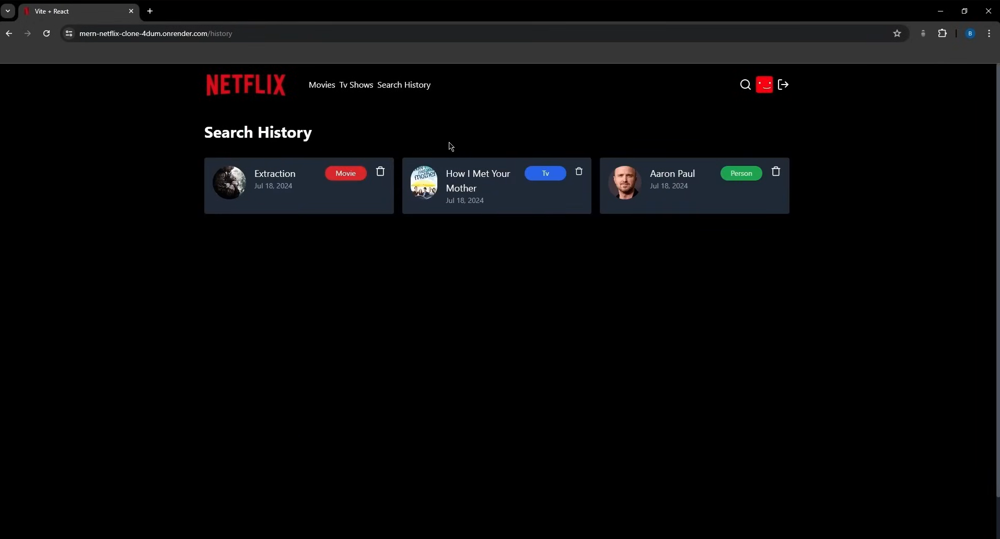

### Netflix Clone 🎬

Welcome to the **Netflix Clone** project! This is a fully-functional web application built using the MERN (MongoDB, Express, React, Node.js) stack. The app mimics the popular streaming service Netflix, offering users the ability to browse, search, and stream movies and TV shows.

## Table of Contents

- [Features](#features)
- [Screenshots](#screenshots)
- [Technologies Used](#technologies-used)
- [API Endpoints](#api-endpoints)
- [Folder Structure](#folder-structure)
- [Contributing](#contributing)
- [License](#license)
- [Contact](#contact)

## Features

- **User Authentication**: Secure sign-up and sign-in using JWT.
- **Browse Movies & TV Shows**: Browse through a wide variety of movies and TV shows.
- **Search Functionality**: Search for your favorite movies and shows.
- **Streaming**: Stream video content directly within the app.
- **Responsive Design**: Fully responsive for mobile, tablet, and desktop devices.

## Screenshots

## Technologies Used

- **Frontend**: React, Redux, Tailwind CSS
- **Backend**: Node.js, Express.js, MongoDB
- **Authentication**: JWT (JSON Web Token)
- **Deployment**: Docker, Heroku (or your preferred service)

## Folder Structure
mern-netflix-clone/
├── .vscode/          # VS Code editor configuration
├── backend/          # Contains all server-side code (Node.js, Express, MongoDB)
├── frontend/         # Contains all client-side code (React.js)
│
├── .gitignore        # Specifies files for Git to ignore
├── Homepage.png      # Screenshot asset for README
├── README.md         # This README file
├── history.png       # Screenshot asset for README
├── package-lock.json # NPM dependency lock file (likely for the backend)
├── package.json      # NPM package details (likely for the backend)
├── screenshot-for-readme.png # Screenshot asset for README
└── search.png        # Screenshot asset for README

## License
MIT License

Copyright (c) 2025 Abhay JK

Permission is hereby granted, free of charge, to any person obtaining a copy
of this software and associated documentation files (the "Software"), to deal
in the Software without restriction, including without limitation the rights
to use, copy, modify, merge, publish, distribute, sublicense, and/or sell
copies of the Software, and to permit persons to whom the Software is
furnished to do so, subject to the following conditions:

The above copyright notice and this permission notice shall be included in all
copies or substantial portions of the Software.

THE SOFTWARE IS PROVIDED "AS IS", WITHOUT WARRANTY OF ANY KIND, EXPRESS OR
IMPLIED, INCLUDING BUT NOT LIMITED TO THE WARRANTIES OF MERCHANTABILITY,
FITNESS FOR A PARTICULAR PURPOSE AND NONINFRINGEMENT. IN NO EVENT SHALL THE
AUTHORS OR COPYRIGHT HOLDERS BE LIABLE FOR ANY CLAIM, DAMAGES OR OTHER
LIABILITY, WHETHER IN AN ACTION OF CONTRACT, TORT OR OTHERWISE, ARISING FROM,
OUT OF OR IN CONNECTION WITH THE SOFTWARE OR THE USE OR OTHER DEALINGS IN THE
SOFTWARE.

